# Ръководство за Пътуването на Клиента GeneForge
## От Подписване на Договора до Доставка на Персонализиран `.geneclone`

Това ръководство ви води **от първия до последния ден** на вашето пътуване с GeneForge — от подписването на договора до доставката и пускането в експлоатация на вашето персонализирано AI клониране.

> **За кого е предназначено?** За вас, ако сте спонсор на проекта, ръководител на проекти или CIO, който следи внедряването на GeneForge.  
> **Колко време отнема?** Обикновено **5–10 работни дни**, в зависимост от това колко бързо споделяте документи и одобрявате решения.

---

## С един поглед

| Фаза | Какво се случва | Вашето усилие | Дни |
|------|-----------------|---------------|-----|
| **0** | Подписан договор, назначен екип | Ниско | Ден 0 |
| **1** | Стартова среща + събиране на документи | **Високо** | 1–2 |
| **2** | Документи обработени в AI паметта | Ниско | 2–3 |
| **3** | AI Съветът проектира вашето клониране | Средно | 3–5 |
| **4** | Клонирането се изгражда и персонализира | Средно | 5–7 |
| **5** | Финален преглед преди доставка | Средно | 7–8 |
| **6** | Пакетът е създаден и изпратен до вас | Ниско | 8–9 |
| **7** | Вие инсталирате и стартирате клонирането | Средно | 9–10 |
| **8** | Постоянен мониторинг и поддръжка | Ниско | Постоянно |

---

## Визуална Хронология

```mermaid
graph LR
    A[Ден 0<br/>Договор] --> B[Дни 1-2<br/>Старт & Документи]
    B --> C[Дни 2-3<br/>Bootstrap Памет]
    C --> D[Дни 3-5<br/>Архитектурен Съвет]
    D --> E[Дни 5-7<br/>Персонализация]
    E --> F[Дни 7-8<br/>Предварителен Преглед]
    F --> G[Дни 8-9<br/>Пакетиране]
    G --> H[Дни 9-10<br/>Разгръщане & Онбординг]
    H --> I[Постоянно<br/>Мониторинг]
    style A fill:#ffcccc
    style G fill:#ccffcc
    style H fill:#ccffcc
```



---

## Фаза 0 — Подписване на Договора → Старт (Ден 0)

### Какво прави GeneForge
- Назначава **Delivery Lead** и **Solutions Architect** за клиента.
- Подготвя **базовия шаблон**, съответстващ на сектора на клиента (напр. `AI_ML_PLATFORM`, `FINTECH`, `HEALTHCARE`).
- Създава работното пространство на клиента във вътрешния двигател на GeneForge.

### Какво прави клиентът
- [ ] Назовава **основен контакт** (CTO, CIO или Ръководител на Дигитална Трансформация).
- [ ] Потвърждава **избрания шаблон** и всички специфични за сектора изисквания.
- [ ] Подписва и връща **Споразумението за Обработка на Данни** (ако документите съдържат лични данни).

### Доставяем Резултат
- Покана за стартова среща (видео разговор, 45–60 мин).

---

## Фаза 1 — Стартова Среща & Събиране на Досие (Дни 1–2)

### Дневен Ред на Стартовата Среща
| Тема | Продължителност | Цел |
|------|-----------------|-----|
| Въведение в методологията GeneForge | 10 мин | Изравняване на очакванията за AI клониране vs. чатботове |
| Преглед на шаблона | 15 мин | Показване на базовия шаблон и опции за персонализация |
| Списък с искани документи | 15 мин | Обяснение какво трябва да предостави клиентът |
| Въпроси & следващи стъпки | 15 мин | Изясняване на времеви рамки, роли и комуникационни канали |

### Документи, които Клиентът Трябва да Предостави
Качеството на клонирането зависи от богатството на входните данни. Искаме:

| Документ | Цел | Приоритет |
|----------|-----|-----------|
| **Преглед на Компанията** | Мисия, визия, ценности, стратегически приоритети | 🔴 Критично |
| **Карта на Процесите** | Основни бизнес процеси и работни потоци | 🔴 Критично |
| **Структура на Екипа** | Организационна диаграма, роли, йерархия на вземане на решения | 🟡 Важно |
| **Финансова Снимка** | Модел на приходите, цели за растеж, бюджетни ограничения | 🟡 Важно |
| **Културни Артефакти** | Вътрешни имейли, документи с ценности, примери за комуникация | 🟢 Желателно |
| **Изисквания за Съответствие** | GDPR, HIPAA, SOX или секторно-специфични регламенти | 🔴 Критично (ако е регламентирано) |
| **Бранд Насоки** | Лого, тон на глас, визуална идентичност | 🟡 Важно |

> **Съвет:** Дори частични или чернови документи са ценни. Съветът от Агенти ще маркира пропуски вместо да халюцинира.

### Доставяем Резултат
- Споделена папка (Google Drive, Dropbox или сигурен SFTP) с документите на клиента.
- Подписано **Споразумение за Обработка на Данни (DPA)**, ако документите съдържат лични данни.

---

## Фаза 2 — Приемане & Bootstrap на Паметта (Дни 2–3)

### Какво прави GeneForge
- **Санитаризира** всички качени документи (сканиране за лични данни, нормализация на формати).
- **Инжектира** документите в системата **Корпоративна Памет**.
- Присвоява **уникален клиентски ID** и инициализира структурата на паметта.

```bash
# Вътрешна операция (екип GeneForge)
python3 -m internal.cli init-client --id <CLIENT_ID> --template <TEMPLATE>
python3 -m internal.cli add-doc --client <CLIENT_ID> --filename company_overview.md --summary "..."
```

### Какво прави клиентът
- [ ] Преглежда **доклада за санитаризация** (ако са открити и редактирани лични данни).
- [ ] Одобрява **индекса на документите** (потвърждава, че нищо чувствително не е пропуснато).
- [ ] Предоставя **липсващи документи**, ако са маркирани от Агента за Приемане.
- [ ] Потвърждава получаването на имейла "Bootstrap на паметта завършен".

### Доставяем Резултат
- `client_memory.json` — структурирано досие, готово за обработка от Съвета.
- Потвърдителен имейл: *"Bootstrap на паметта завършен. Продължаваме към Архитектурния Съвет."*

---

## Фаза 3 — Архитектурен Съвет (Дни 3–5)

### Какво се случва
Вътрешният двигател на GeneForge свиква **Съвета от Агенти**, за да реши как да персонализира шаблона:
- Агент Приемане & Анализ
- Агент Клониране
- Агент Личност & Култура
- Агент Консултации за AI Решения
- Агент Разгръщане & Пакетиране
- Съответствие & AI Act GATE (Red Team)
- QA & Mirror Test GATE (Red Team)

### Участие на Клиента
Клиентът **не е задължен да присъства** на автоматизирания Съвет, но силно препоръчваме **30-минутен прегледен разговор**, в който представяме:
- **CEO Meta Status Update** (синтез на дебата в Съвета).
- **Оценката на рисковете от Red Team** (сценарии за 3/6/12 месеца).
- **Препоръчаната архитектура** за персонализираното клониране.

### Обратна Връзка от Клиента
Ако клиентът не е съгласен с препоръката:
1. Изпраща писмена обратна връзка (имейл или споделен документ).
2. GeneForge изпълнява **втори лек Съвет** с новите ограничения.
3. Ревизирано решение се издава в рамките на 24 часа.

### Какво прави клиентът
- [ ] Присъства на **30-минутния разговор за Преглед на Архитектурата** (препоръчително).
- [ ] Преглежда оценката на рисковете от Red Team (сценарии за 3/6/12 месеца).
- [ ] Одобрява или иска промени в препоръчаната архитектура.
- [ ] Подписва **Architecture Decision Record (ADR)**.

### Доставяем Резултат
- **Architecture Decision Record (ADR)** — одобрен от клиента.
- **Blueprint за Персонализация** — спецификация на всички персонализации.

---

## Фаза 4 — Персонализация на Blueprint (Дни 5–7)

### Какво прави GeneForge
- **Персонализира prompt-овете на агентите**, използвайки одобрения blueprint.
- **Прилага културни адаптации** (език, тон, стил на вземане на решения).
- **Интегрира контролни точки за съответствие** (AI Act, GDPR, секторно-специфични).
- **Изпълнява unit тестове** на всеки персонализиран модул.

### Какво прави клиентът
- [ ] Преглежда скрийншоти от предварителен преглед на wizard-а за онбординг (ако UI е персонализиран).
- [ ] Валидира специфичната за сектора **терминология** и жаргон.
- [ ] Потвърждава **точките на интеграция** (API-та, източници на данни, SSO конектори).
- [ ] Одобрява **Customization Manifest** (одитна пътека на всички промени).

### Quality Gates
| Gate | Проверка | Отговорник |
|------|----------|------------|
| Функционална пълнота | Всички елементи от blueprint са имплементирани | GeneForge Engineering |
| Културно изравняване | Тон и терминология валидирани | Клиент + Агент Личност |
| Съответствие | Регулаторни контролни точки преминати | Compliance GATE |
| Документация | Customization manifest генериран | GeneForge Docs Lead |

### Доставяем Резултат
- Директория `.work/` с персонализирания blueprint (вътрешен преглед).
- **Customization Manifest** — одитна пътека на всяка промяна.

---

## Фаза 5 — Съвет Преди Доставка (Дни 7–8)

### Какво се случва
Втори Съвет се събира за **Преглед Преди Доставка**:
- Валидира готовността спрямо оригиналното досие.
- Изпълнява **Mirror Test** (дали това клониране би минало за човешки служител?).
- Повторно активира **Red Team**, за да атакува финалния пакет.

### Участие на Клиента
- **Задължителен 15-минутен разговор за одобрение**.
- Клиентът получава **Memo за Преглед Преди Доставка**, съдържащо:
  - Решение Go/No-Go
  - Оставащи рискове (ако има)
  - План за мониторинг след доставка

### Какво прави клиентът
- [ ] Присъства на **разговора за одобрение Преди Доставка** (15 мин).
- [ ] Преглежда **Memo за Преглед Преди Доставка**.
- [ ] Потвърждава **Risk Register**.
- [ ] Потвърждава решение Go/No-Go.

### Възможни Изходи
| Изход | Следваща Стъпка |
|-------|-----------------|
| **Go** | Продължаване към пакетиране и доставка (Ден 8) |
| **Go с условия** | Коригиране на дребни елементи (обикновено забавяне 24ч) |
| **No-Go** | Връщане към Фаза 4 с ревизирани изисквания (рядко) |

### Доставяем Резултат
- Подписано **Memo за Преглед Преди Доставка**.
- **Risk Register** — потвърден от клиента.

---
## Фаза 6 — Пакетиране & Доставка (Дни 8–9)

### Какво прави GeneForge
1. **Пакетира** персонализираното клониране в артефакт `.geneclone`.
2. **Генерира** `FINAL_REPORT.md` (пълна одитна пътека).
3. **Изчислява checksum** на пакета за проверка на интегритета.
4. **Доставя** през сигурен канал, съгласуван в договора.

```bash
# Вътрешен етап на пакетиране
python3 -m internal.cli build --client <CLIENT_ID> --template <TEMPLATE>
# Изход: GeneForge-Custom-<Име>-v1.0.geneclone
```

### Съдържание на Доставчния Пакет
```
📦 GeneForge-Custom-<Клиент>-v1.0.geneclone
├── agents/                    # Персонализирани AI prompt-ове
├── config/                    # Конфигурация за изпълнение
├── wizard/                    # Streamlit приложение за онбординг
├── restore-geneclone.sh       # Скрипт за възстановяване с една команда
├── FINAL_REPORT.md            # Пълна одитна пътека
└── checksum.sha256            # Проверка на интегритета
```

### Какво прави клиентът
- [ ] **Проверява интегритета на пакета**, използвайки предоставения checksum.
- [ ] **Потвърждава получаването** чрез имейл или портал.
- [ ] Съхранява сигурно файла `.geneclone` и `FINAL_REPORT.md`.

### Доставяем Резултат
- Файл `.geneclone` + `FINAL_REPORT.md`.
- Deploy Guide ([GENEFORGE_DEPLOY_GUIDE_BG.md](GENEFORGE_DEPLOY_GUIDE_BG.md)).

---

## Фаза 7 — Разгръщане & Онбординг (Дни 9–10)

### Какво прави клиентът
- [ ] Следва [Deploy Guide](GENEFORGE_DEPLOY_GUIDE_BG.md), за да извлече и стартира.
- [ ] Завършва стъпките на wizard-а за онбординг (Health Check → Активиране на Агенти → Тест на Интеграцията → Go Live).
- [ ] Потвърждава успешното стартиране по време на разговора за отдалечена поддръжка.

### Какво прави GeneForge
- **Отдалечена поддръжка** по време на първото стартиране (по избор, включено в повечето договори).
- **Health check** на разгърнатото клониране.
- **Обучителна сесия** за администратори (1 час, по избор).

### Доставяем Резултат
- Клониране, работещо на инфраструктурата на клиента.
- Администраторски достъп до Streamlit wizard-а.
- Отворен канал за тикети за поддръжка.

---

## Фаза 8 — Мониторинг След Доставка (Постоянно)

### Проверка на 30-ия Ден
- [ ] GeneForge преглежда телеметрията за използване и базовите показатели за производителност.
- [ ] Клиентът попълва кратка анкета за удовлетвореност.

### Преглед на 90-ия Ден
- [ ] GeneForge изпълнява drift detection (дали клонирането се е отклонило от културата?).
- [ ] Клиентът предоставя актуализирани документи, ако приоритетите са се променили.
- [ ] **Повторна активиране на Съвета**, ако са необходими сериозни актуализации.

### Непрекъсната Поддръжка
- Канал за поддръжка по имейл/Slack (време за отговор: 24ч).
- Тримесечни бизнес прегледи (enterprise клиенти).
- Корекции за сигурност и актуализации на шаблони.

---

## 🚨 Когато Нещата Вървят Нагре — Сценарии No-Go & Възстановяване

> **Нещата могат да се объркат. Добрата новина: имаме план за всеки сценарий.**
>
> По-долу са четирите най-чести спънки по пътя, какво означават за вашата времева рамка и точно как ги отстраняваме заедно.

### Сценарий А: Не можете да предоставите документи навреме
**Какво означава:** Забавяне във Фаза 2 (Bootstrap Памет).  
**Как го отстраняваме:**
1. Продължаваме с **леко досие**, използвайки публична информация + кратко интервю.
2. Вие изпращате документи в рамките на 5 работни дни; преизпълняваме Съвета.
3. Ако документите никога не пристигнат, проектът се паузира до следващото **плащане по етап**.

### Сценарий Б: Не сте съгласни с препоръката на AI Съвета
**Какво означава:** Връщаме се към Фаза 3 за ревизиран Съвет.  
**Как го отстраняваме:**
1. Вие ни изпращате писмена обратна връзка с вашите конкретни притеснения.
2. Изпълняваме **втори лек Съвет** в рамките на 24 часа.
3. Ако все още не сме съгласувани, планираме **човешка escalation среща** с нашия CTO.

### Сценарий В: Прегледът Преди Доставка казва "No-Go"
**Какво означава:** Доставката се забавя, докато отстраняваме оставащите проблеми.  
**Как го отстраняваме:**
1. Изпращаме ви **план за коригиране**, който изброява точно какво трябва да се поправи.
2. Прилагаме корекциите и преизпълняваме **мини Преглед Преди Доставка**.
3. Типично забавяне: **24–48 часа** за дребни елементи; **3–5 дни** за сериозно преработване.

### Сценарий Г: Клонирането не стартира на вашите сървъри
**Какво означава:** Клонирането не се стартира след извличане.  
**Как го отстраняваме:**
1. Вие отваряте **тикет за поддръжка** и споделяте логовете на грешки.
2. Предоставяме отдалечено отстраняване на неизправности чрез споделяне на екран.
3. Ако вашата инфраструктура е несъвместима, се прилага клауза за **възстановяване на суми или пренасочване на архитектурата** според договора.

### Път за Ескалация
```
Delivery Lead → Solutions Architect → CTO (GeneForge)
     ↑                ↑                    ↑
   SLA 4ч          SLA 8ч              SLA 24ч
```

---

## Обобщена Хронология

| Фаза | Продължителност | Усилие от Клиента | Усилие от GeneForge |
|------|-----------------|-------------------|---------------------|
| 0 — Подпис → Старт | Ден 0 | Ниско | Ниско |
| 1 — Старт & Документи | Дни 1–2 | **Високо** (събиране на документи) | Средно |
| 2 — Bootstrap Памет | Дни 2–3 | Ниско (преглед) | Средно |
| 3 — Архитектурен Съвет | Дни 3–5 | Средно (прегледна среща) | **Високо** |
| 4 — Персонализация | Дни 5–7 | Средно (валидация) | **Високо** |
| 5 — Преглед Преди Доставка | Дни 7–8 | Средно (среща за одобрение) | **Високо** |
| 6 — Пакетиране & Доставка | Дни 8–9 | Ниско (проверка на получаване) | Средно |
| 7 — Разгръщане | Дни 9–10 | Средно (инсталиране на wizard) | Ниско (поддръжка) |
| 8 — Мониторинг | Постоянно | Ниско | Средно |

---

## Контакти за Спешни Случаи

| Роля | Отговорност | Време за Отговор |
|------|-------------|------------------|
| Delivery Lead | Координация на проекта, ескалация | 4 часа |
| Solutions Architect | Технически проблеми с интеграцията | 8 часа |
| Customer Success | Обучение, поддръжка при онбординг | 24 часа |
| AI Ethics Officer | Съответствие, пристрастия, притеснения за сигурност | 24 часа |

---

## Свързани Документи

- [MANUALE_BG.md](MANUALE_BG.md) — Вътрешно ръководство за двигателя (екип GeneForge)
- [QUICKSTART_BG.md](QUICKSTART_BG.md) — Шпаргалка за 5 минути
- [GENEFORGE_DEPLOY_GUIDE_BG.md](GENEFORGE_DEPLOY_GUIDE_BG.md) — Технически стъпки за разгръщане
- [CUDA_DEVELOPMENT_GUIDE.md](CUDA_DEVELOPMENT_GUIDE.md) — Оптимизация за DGX Spark

---

*Последна актуализация: 2026-04-16*  
*Версия: 1.1 — Пътуване на Клиента След Договор (приятелска за клиента ревизия)*
