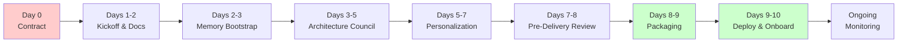

# GeneForge AI Labs — Customer Journey Guide
## English Version
## From Contract Signature to Custom `.geneclone` Delivery

This guide outlines the **collaborative steps** between the GeneForge team and the client to transform a base template into a fully personalized AI clone.

> **Audience:** Project Managers, Customer Success, and client stakeholders.  
> **Timeline:** Typically 5–10 business days from kickoff to delivery, depending on client responsiveness and template complexity.

## Visual Timeline



---

## Phase 0 — Contract Signature → Kickoff (Day 0)

### What GeneForge does
- Assigns a **Delivery Lead** and **Solutions Architect** to the client.
- Prepares the **base template** matching the client's industry (e.g., `AI_ML_PLATFORM`, `FINTECH`, `HEALTHCARE`).
- Creates the client workspace in the GeneForge Internal Engine.

### What the client does
- [ ] Name a **primary contact** (CTO, CIO, or Digital Transformation Lead).
- [ ] Confirm the **chosen template** and any sector-specific requirements.
- [ ] Sign and return the **Data Processing Agreement** (if documents contain PII).

### Deliverable
- Kickoff meeting invitation (video call, 45–60 min).

---

## Phase 1 — Kickoff & Dossier Collection (Days 1–2)

### Kickoff Meeting Agenda
| Topic | Duration | Purpose |
|-------|----------|---------|
| Introduction to GeneForge methodology | 10 min | Align expectations on AI cloning vs. chatbots |
| Template walkthrough | 15 min | Show the base template and customization options |
| Document request list | 15 min | Explain what the client must provide |
| Q&A and next steps | 15 min | Clarify timelines, roles, and communication channels |

### Documents the Client Must Provide
The quality of the clone depends on the richness of the input. We ask for:

| Document | Purpose | Priority |
|----------|---------|----------|
| **Company Overview** | Mission, vision, values, strategic priorities | 🔴 Critical |
| **Process Map** | Core business processes and workflows | 🔴 Critical |
| **Team Structure** | Org chart, roles, decision-making hierarchy | 🟡 Important |
| **Financial Snapshot** | Revenue model, growth objectives, budget constraints | 🟡 Important |
| **Culture Artifacts** | Internal emails, values documents, communication examples | 🟢 Nice to have |
| **Compliance Requirements** | GDPR, HIPAA, SOX, or industry-specific regulations | 🔴 Critical (if regulated) |
| **Brand Guidelines** | Logo, tone of voice, visual identity | 🟡 Important |

> **Tip:** Even partial or draft documents are valuable. The Council of Agents will flag gaps rather than hallucinate.

### Deliverable
- Shared folder (Google Drive, Dropbox, or secure SFTP) with client's documents.
- Signed **Data Processing Agreement** (DPA) if documents contain PII.

---

## Phase 2 — Intake & Memory Bootstrap (Days 2–3)

### What GeneForge does
- **Sanitizes** all uploaded documents (PII scan, format normalization).
- **Ingests** documents into the **Corporate Memory** system.
- Assigns a **unique client ID** and initializes the memory structure.

```bash
# Internal operation (GeneForge team)
python3 -m internal.cli init-client --id <CLIENT_ID> --template <TEMPLATE>
python3 -m internal.cli add-doc --client <CLIENT_ID> --filename company_overview.md --summary "..."
```

### What the client does
- [ ] Review the **sanitization report** (if PII was found and redacted).
- [ ] Approve the **document index** (confirms nothing sensitive was missed).
- [ ] Provide **missing documents** if flagged by the Intake Agent.
- [ ] Confirm receipt of the "Memory bootstrap complete" email.

### Deliverable
- `client_memory.json` — structured dossier ready for Council processing.
- Confirmation email: *"Memory bootstrap complete. Proceeding to Architecture Council."*

---

## Phase 3 — Architecture Council (Days 3–5)

### What happens
The GeneForge Internal Engine convenes the **Council of Agents** to decide how to personalize the template:
- Intake & Analysis Agent
- Cloner Agent
- Personality & Culture Agent
- AI Solutions Advisory Agent
- Deployment & Packaging Agent
- Compliance & AI Act GATE (Red Team)
- QA & Mirror Test GATE (Red Team)

### Client Involvement
The client is **not required to attend** the automated Council, but we strongly recommend a **30-minute review call** where we present:
- The **CEO Meta Status Update** (synthesis of the Council debate).
- The **Red Team risk assessment** (3/6/12-month scenarios).
- The **recommended architecture** for the personalized clone.

### Client Feedback Loop
If the client disagrees with the recommendation:
1. Submit written feedback (email or shared doc).
2. GeneForge runs a **second light-round Council** with the new constraints.
3. A revised decision is issued within 24 hours.

### What the client does
- [ ] Attend the **30-minute Architecture Review call** (recommended).
- [ ] Review the Red Team risk assessment (3/6/12-month scenarios).
- [ ] Approve or request changes to the recommended architecture.
- [ ] Sign the **Architecture Decision Record (ADR)**.

### Deliverable
- **Architecture Decision Record (ADR)** — signed off by client.
- **Personalization Blueprint** — specification of all customizations.

---

## Phase 4 — Blueprint Personalization (Days 5–7)

### What GeneForge does
- **Personalizes agent prompts** using the approved blueprint.
- **Applies cultural adaptations** (language, tone, decision-making style).
- **Integrates compliance checkpoints** (AI Act, GDPR, industry-specific).
- **Runs unit tests** on every customized module.

### What the client does
- [ ] Review preview screenshots of the onboarding wizard (if UI was customized).
- [ ] Validate industry-specific **terminology** and jargon.
- [ ] Confirm **integration points** (APIs, data sources, SSO connectors).
- [ ] Approve the **Customization Manifest** (audit trail of all changes).

### Quality Gates
| Gate | Check | Owner |
|------|-------|-------|
| Functional completeness | All blueprint items implemented | GeneForge Engineering |
| Cultural alignment | Tone and terminology validated | Client + Personality Agent |
| Compliance | Regulatory checkpoints passed | Compliance GATE |
| Documentation | Customization manifest generated | GeneForge Docs Lead |

### Deliverable
- `.work/` directory with the personalized blueprint (internal preview).
- **Customization Manifest** — audit trail of every change.

---

## Phase 5 — Pre-Delivery Council (Days 7–8)

### What happens
A second Council convenes for the **Pre-Delivery Review**:
- Validates readiness against the original dossier.
- Runs the **Mirror Test** (would this clone pass for a human employee?).
- Re-activates the **Red Team** to attack the final package.

### Client Involvement
- **Mandatory 15-minute sign-off call**.
- Client receives the **Pre-Delivery Review Memo** with:
  - Go/No-Go decision
  - Outstanding risks (if any)
  - Post-delivery monitoring plan

### What the client does
- [ ] Attend the **Pre-Delivery sign-off call** (15 min).
- [ ] Review the **Pre-Delivery Review Memo**.
- [ ] Acknowledge the **Risk Register**.
- [ ] Confirm Go/No-Go decision.

### Possible Outcomes
| Outcome | Next Step |
|---------|-----------|
| **Go** | Proceed to packaging and delivery (Day 8) |
| **Go with conditions** | Fix minor items (typically 24h delay) |
| **No-Go** | Return to Phase 4 with revised requirements (rare) |

### Deliverable
- Signed **Pre-Delivery Review Memo**.
- **Risk Register** — acknowledged by client.

---

## Phase 6 — Packaging & Delivery (Day 8–9)

### What GeneForge does
1. **Packages** the personalized clone into a `.geneclone` artifact.
2. **Generates** the `FINAL_REPORT.md` (full audit trail).
3. **Checksums** the package for integrity verification.
4. **Delivers** via secure channel agreed in contract.

```bash
# Internal packaging step
python3 -m internal.cli build --client <CLIENT_ID> --template <TEMPLATE>
# Output: GeneForge-Custom-<Name>-v1.0.geneclone
```

### Delivery Package Contents
```
📦 GeneForge-Custom-<Client>-v1.0.geneclone
├── agents/                    # Personalized AI prompts
├── config/                    # Runtime configuration
├── wizard/                    # Onboarding Streamlit app
├── restore-geneclone.sh       # One-command restore script
├── FINAL_REPORT.md            # Complete audit trail
├── license.key                # Machine-bound license (required on first run)
└── checksum.sha256            # Integrity verification
```

### What the client does
- [ ] **Verify the package integrity** using the provided checksum.
- [ ] **Acknowledge receipt** via email or portal.
- [ ] Store the `.geneclone` file and `FINAL_REPORT.md` securely.

### Deliverable
- `.geneclone` file + `FINAL_REPORT.md`.
- Deploy Guide ([GENEFORGE_DEPLOY_GUIDE.md](GENEFORGE_DEPLOY_GUIDE_EN.md)).

---

## Phase 7 — Deployment & Onboarding (Days 9–10)

### What the client does
- [ ] Follow the [Deploy Guide](GENEFORGE_DEPLOY_GUIDE_EN.md) to extract and launch.
- [ ] Complete the onboarding wizard steps (Health Check → Agent Activation → Integration Test → Go Live).
- [ ] Confirm successful launch during the remote support call.

### What GeneForge does
- **Remote support** during first launch (optional, included in most contracts).
- **Health check** of the deployed clone.
- **Training session** for admin users (1 hour, optional).

### Deliverable
- Clone running on client's infrastructure.
- Admin access to the Streamlit wizard.
- Support ticket channel opened.

---

## Phase 8 — Post-Delivery Monitoring (Ongoing)

### 30-Day Check-in
- [ ] GeneForge reviews usage telemetry and performance baseline.
- [ ] Client completes a short satisfaction survey.

### 90-Day Review
- [ ] GeneForge runs drift detection (has the clone deviated from culture?).
- [ ] Client provides updated documents if priorities changed.
- [ ] **Council Re-activation** scheduled if major updates are needed.

### Continuous Support
- Email/Slack support channel (response time: 24h).
- Quarterly business reviews (enterprise clients).
- Security patches and template updates.

---

## When Things Go Wrong — No-Go & Recovery Scenarios

### Scenario A: Client cannot provide documents on time
**Impact:** Delay in Phase 2 (Memory Bootstrap).  
**Recovery:**
1. GeneForge proceeds with a **lightweight dossier** (public info + interview).
2. Client provides documents within 5 business days; Council is re-run.
3. If documents never arrive, project pauses until **milestone payment** is clarified.

### Scenario B: Client rejects the Architecture Council recommendation
**Impact:** Return to Phase 3 (revised Council).  
**Recovery:**
1. Client submits written feedback with specific constraints.
2. GeneForge runs a **second light-round Council** within 24h.
3. If still unresolved, a **human escalation call** is scheduled with the CTO.

### Scenario C: Pre-Delivery Review returns "No-Go"
**Impact:** Delay in delivery (return to Phase 4).  
**Recovery:**
1. GeneForge provides a **remediation plan** with exact items to fix.
2. Fixes are applied and a **mini Pre-Delivery Review** is re-run.
3. Typical delay: 24–48 hours for minor items; 3–5 days for major rework.

### Scenario D: Deployment fails on client infrastructure
**Impact:** Clone does not launch after extraction.  
**Recovery:**
1. Client opens a **support ticket** with error logs.
2. GeneForge provides remote troubleshooting (screen share).
3. If infrastructure is incompatible, a **refund or re-architecture** clause applies per contract.

### Escalation Path
```
Delivery Lead → Solutions Architect → CTO (GeneForge)
     ↑                ↑                    ↑
   4h SLA          8h SLA              24h SLA
```

---

## Summary Timeline

| Phase | Duration | Client Effort | GeneForge Effort |
|-------|----------|---------------|------------------|
| 0 — Signature → Kickoff | Day 0 | Low | Low |
| 1 — Kickoff & Docs | Days 1–2 | **High** (gather docs) | Medium |
| 2 — Memory Bootstrap | Days 2–3 | Low (review) | Medium |
| 3 — Architecture Council | Days 3–5 | Medium (review call) | **High** |
| 4 — Personalization | Days 5–7 | Medium (validation) | **High** |
| 5 — Pre-Delivery Review | Days 7–8 | Medium (sign-off call) | **High** |
| 6 — Packaging & Delivery | Days 8–9 | Low (verify receipt) | Medium |
| 7 — Deployment | Days 9–10 | Medium (install wizard) | Low (support) |
| 8 — Monitoring | Ongoing | Low | Medium |

---

## Emergency Contacts

| Role | Responsibility | Response Time |
|------|----------------|---------------|
| Delivery Lead | Project coordination, escalation | 4 hours |
| Solutions Architect | Technical integration issues | 8 hours |
| Customer Success | Training, onboarding support | 24 hours |
| AI Ethics Officer | Compliance, bias, safety concerns | 24 hours |

---

## Related Documents

- [MANUALE.md](MANUALE_EN.md) — Internal engine manual (GeneForge team)
- [QUICKSTART.md](QUICKSTART_EN.md) — 5-minute cheat sheet
- [GENEFORGE_DEPLOY_GUIDE.md](GENEFORGE_DEPLOY_GUIDE_EN.md) — Technical deployment steps
- [CUDA_DEVELOPMENT_GUIDE.md](CUDA_DEVELOPMENT_GUIDE.md) — DGX Spark optimization

---

*Last updated: 2026-04-16*  
*Version: 1.1 — Post-Contract Customer Journey (client-friendly revision)*
