# GeneForge AI Labs — Guida al Percorso Cliente
## Dalla Firma del Contratto alla Consegna del `.geneclone` Personalizzato

Questa guida ti accompagna **dal primo all'ultimo giorno** del tuo percorso con GeneForge — dalla firma del contratto alla consegna e all'avvio del tuo clone AI personalizzato.

> **A chi è rivolta?** A te, se sei il sponsor del progetto, il project manager o il CIO che segue l'implementazione GeneForge.  
> **Quanto dura?** Solitamente **5–10 giorni lavorativi**, a seconda di quanto rapidamente condividi i documenti e approvi le decisioni.

---

## A Colpo d'Occhio

| Fase | Cosa succede | Il tuo impegno | Giorni |
|------|--------------|----------------|--------|
| **0** | Firma contratto, team assegnato | Basso | Giorno 0 |
| **1** | Riunione kickoff + raccolta documenti | **Alto** | 1–2 |
| **2** | Documenti processati in memoria AI | Basso | 2–3 |
| **3** | Il Consiglio AI progetta il tuo clone | Medio | 3–5 |
| **4** | Il clone viene costruito e personalizzato | Medio | 5–7 |
| **5** | Revisione finale prima della consegna | Medio | 7–8 |
| **6** | Pacchetto creato e inviato a te | Basso | 8–9 |
| **7** | Tu installi e avvii il clone | Medio | 9–10 |
| **8** | Monitoraggio e supporto continuo | Basso | Continuo |

---

## Cronologia Compatta

| Step | Fase | Azione GeneForge | La tua azione | Durata |
|------|------|------------------|---------------|--------|
| 0 | Contratto | Assegna team, sceglie template | Indica un contatto, firma DPA | Giorno 0 |
| 1 | Kickoff | Conduce riunione kickoff | Raccoglie e carica documenti | Giorni 1–2 |
| 2 | Intake | Sanitizza e ingoia documenti | Approva report di sanitizzazione | Giorni 2–3 |
| 3 | Consiglio | Il Consiglio AI progetta il clone | Partecipa a call di review 30 min | Giorni 3–5 |
| 4 | Build | Personalizza prompt e UI | Valida terminologia e UI | Giorni 5–7 |
| 5 | Revisione | Consiglio Pre-Consegna | Partecipa a call di approvazione 15 min | Giorni 7–8 |
| 6 | Package | Crea artefatto `.geneclone` | Verifica checksum e conferma | Giorni 8–9 |
| 7 | Avvio | Supporto remoto | Esegue wizard e va live | Giorni 9–10 |
| 8 | Monitoraggio | Telemetria e drift detection | Sondaggi di soddisfazione | Continuo |

---

## Cronologia Visiva

```mermaid
graph LR
    A[Giorno 0<br/>Contratto] --> B[Giorni 1-2<br/>Avvio & Documenti]
    B --> C[Giorni 2-3<br/>Bootstrap Memoria]
    C --> D[Giorni 3-5<br/>Consiglio Architettura]
    D --> E[Giorni 5-7<br/>Personalizzazione]
    E --> F[Giorni 7-8<br/>Revisione Pre-Consegna]
    F --> G[Giorni 8-9<br/>Packaging]
    G --> H[Giorni 9-10<br/>Deploy & Onboarding]
    H --> I[Continuo<br/>Monitoraggio]
    style A fill:#ffcccc
    style G fill:#ccffcc
    style H fill:#ccffcc
```



---

## Fase 0 — Firma Contratto → Avvio (Giorno 0)

### Cosa fa GeneForge
- Assegna un **Delivery Lead** e un **Solutions Architect** al cliente.
- Prepara il **template di base** corrispondente al settore del cliente (es. `AI_ML_PLATFORM`, `FINTECH`, `HEALTHCARE`).
- Crea lo spazio di lavoro del cliente nel motore interno GeneForge.

### Cosa fa il cliente
- [ ] Indica un **contatto principale** (CTO, CIO o Responsabile Trasformazione Digitale).
- [ ] Conferma il **template scelto** e eventuali requisiti settore-specifici.
- [ ] Firma e restituisce il **Contratto di Trattamento Dati** (se i documenti contengono Dati Personali).

### Deliverable
- Invito alla riunione di kickoff (videochiamata, 45–60 min).

---

## Fase 1 — Kickoff & Raccolta Dossier (Giorni 1–2)

### Agenda della Riunione di Kickoff
| Argomento | Durata | Scopo |
|-----------|--------|-------|
| Introduzione alla metodologia GeneForge | 10 min | Allineare le aspettative su clonazione AI vs. chatbot |
| Panoramica del template | 15 min | Mostrare il template di base e le opzioni di personalizzazione |
| Elenco documenti richiesti | 15 min | Spiegare cosa deve fornire il cliente |
| Q&A e prossimi passi | 15 min | Chiarire tempistiche, ruoli e canali di comunicazione |

### Documenti che il Cliente Deve Fornire
La qualità del clone dipende dalla ricchezza degli input. Richiediamo:

| Documento | Scopo | Priorità | Formato Consigliato |
|-----------|-------|----------|---------------------|
| **Panoramica Aziendale** | Mission, vision, valori, priorità strategiche | 🔴 Critico | PDF, Word o Markdown (2–10 pagine) |
| **Mappa Processi** | Processi core e flussi di lavoro | 🔴 Critico | Diagramma BPMN, flowchart PNG o elenco Markdown |
| **Struttura Team** | Organigramma, ruoli, gerarchia decisionale | 🟡 Importante | Organigramma PDF, slide PowerPoint o spreadsheet |
| **Snapshot Finanziario** | Modello di ricavo, obiettivi di crescita, vincoli di budget | 🟡 Importante | Report PDF o Excel (solo dati riassuntivi) |
| **Artefatti Cultura** | Email interne, documenti sui valori, esempi di comunicazione | 🟢 Utile | Scansioni PDF, email esportate o documenti Word |
| **Requisiti Compliance** | GDPR, HIPAA, SOX o regolamenti settore-specifici | 🔴 Critico (se regolamentato) | Certificati PDF, documenti policy o report di audit |
| **Linee Guida Brand** | Logo, tono di voce, identità visiva | 🟡 Importante | Brand book PDF, ZIP con asset o link a style guide |

> **Suggerimento:** Anche documenti parziali o in bozza sono preziosi. Il Consiglio di Agenti segnalerà le lacune invece di allucinare.

### Deliverable
- Cartella condivisa (Google Drive, Dropbox o SFTP sicuro) con i documenti del cliente.
- **Contratto di Trattamento Dati** (DPA) firmato se i documenti contengono Dati Personali.

---

## Fase 2 — Intake & Bootstrap Memoria (Giorni 2–3)

### Cosa fa GeneForge
- **Sanitizza** tutti i documenti caricati (scansione Dati Personali, normalizzazione formati).
- **Ingerisce** i documenti nel sistema **Memoria Aziendale**.
- Assegna un **ID cliente univoco** e inizializza la struttura della memoria.

```bash
# Operazione interna (team GeneForge)
python3 -m internal.cli init-client --id <CLIENT_ID> --template <TEMPLATE>
python3 -m internal.cli add-doc --client <CLIENT_ID> --filename company_overview.md --summary "..."
```

### Cosa fa il cliente
- [ ] Revisiona il **report di sanitizzazione** (se sono stati trovati e redatti Dati Personali).
- [ ] Approva l'**indice documenti** (conferma che nulla di sensibile sia stato tralasciato).
- [ ] Fornisce **documenti mancanti** se segnalati dall'Agente Intake.
- [ ] Conferma la ricezione dell'email "Bootstrap memoria completato".

### Deliverable
- `client_memory.json` — dossier strutturato pronto per l'elaborazione del Consiglio.
- Email di conferma: *"Bootstrap memoria completato. Procediamo al Consiglio di Architettura."*

---

## Fase 3 — Consiglio di Architettura (Giorni 3–5)

### Cosa succede
Il motore interno GeneForge convoca il **Consiglio di Agenti** per decidere come personalizzare il template:
- Agente Intake & Analisi
- Agente Cloner
- Agente Personalità & Cultura
- Agente Consulenza Soluzioni AI
- Agente Deploy & Packaging
- Compliance & AI Act GATE (Red Team)
- QA & Mirror Test GATE (Red Team)

### Coinvolgimento del Cliente
Il cliente **non è tenuto a partecipare** al Consiglio automatizzato, ma consigliamo vivamente una **call di revisione di 30 minuti** in cui presentiamo:
- Lo **CEO Meta Status Update** (sintesi del dibattito del Consiglio).
- La **valutazione rischi Red Team** (scenari a 3/6/12 mesi).
- L'**architettura consigliata** per il clone personalizzato.

### Ciclo di Feedback del Cliente
Se il cliente non è d'accordo con la raccomandazione:
1. Invia feedback scritto (email o documento condiviso).
2. GeneForge esegue un **secondo Consiglio light-round** con i nuovi vincoli.
3. Una decisione rivista viene emessa entro 24 ore.

### Cosa fa il cliente
- [ ] Partecipa alla **call di Revisione Architettura di 30 minuti** (consigliata).
- [ ] Revisiona la valutazione rischi Red Team (scenari a 3/6/12 mesi).
- [ ] Approva o richiede modifiche all'architettura consigliata.
- [ ] Firma il **Architecture Decision Record (ADR)**.

### Deliverable
- **Architecture Decision Record (ADR)** — approvato dal cliente.
- **Blueprint di Personalizzazione** — specifica di tutte le personalizzazioni.

---

## Fase 4 — Personalizzazione Blueprint (Giorni 5–7)

### Cosa fa GeneForge
- **Personalizza i prompt degli agenti** usando il blueprint approvato.
- **Applica adattamenti culturali** (lingua, tono, stile decisionale).
- **Integra checkpoint di compliance** (AI Act, GDPR, settore-specifici).
- **Esegue unit test** su ogni modulo personalizzato.

### Cosa fa il cliente
- [ ] Revisiona gli screenshot di anteprima della procedura di onboarding (se l'UI è stata personalizzata).
- [ ] Valida la **terminologia** e il gergo specifico del settore.
- [ ] Conferma i **punti di integrazione** (API, sorgenti dati, connettori SSO).
- [ ] Approva il **Customization Manifest** (traccia di audit di tutte le modifiche).

### Quality Gates
| Gate | Controllo | Responsabile |
|------|-----------|--------------|
| Completezza funzionale | Tutti gli elementi del blueprint implementati | GeneForge Engineering |
| Allineamento culturale | Tono e terminologia validati | Cliente + Agente Personalità |
| Compliance | Checkpoint regolatori superati | Compliance GATE |
| Documentazione | Customization manifest generato | GeneForge Docs Lead |

### Deliverable
- Directory `.work/` con il blueprint personalizzato (anteprima interna).
- **Customization Manifest** — traccia di audit di ogni modifica.

---

## Fase 5 — Consiglio Pre-Consegna (Giorni 7–8)

### Cosa succede
Un secondo Consiglio si riunisce per la **Revisione Pre-Consegna**:
- Valuta la prontezza rispetto al dossier originale.
- Esegue il **Mirror Test** (questo clone passerebbe per un dipendente umano?).
- Riattiva il **Red Team** per attaccare il pacchetto finale.

### Coinvolgimento del Cliente
- **Call di approvazione obbligatoria di 15 minuti**.
- Il cliente riceve la **Memo di Revisione Pre-Consegna** con:
  - Decisione Go/No-Go
  - Rischi residui (se presenti)
  - Piano di monitoraggio post-consegna

### Cosa fa il cliente
- [ ] Partecipa alla **call di approvazione Pre-Consegna** (15 min).
- [ ] Revisiona la **Memo di Revisione Pre-Consegna**.
- [ ] Riconosce il **Risk Register**.
- [ ] Conferma la decisione Go/No-Go.

### Possibili Esiti
| Esito | Prossimo Passo |
|-------|----------------|
| **Go** | Procedere al packaging e consegna (Giorno 8) |
| **Go con condizioni** | Correggere elementi minori (tipicamente ritardo di 24h) |
| **No-Go** | Tornare alla Fase 4 con requisiti rivisti (raro) |

### Deliverable
- **Memo di Revisione Pre-Consegna** firmata.
- **Risk Register** — riconosciuto dal cliente.

---
## Fase 6 — Packaging & Consegna (Giorni 8–9)

### Cosa fa GeneForge
1. **Packaging** del clone personalizzato in un artefatto `.geneclone`.
2. **Generazione** del `FINAL_REPORT.md` (traccia di audit completa).
3. **Checksum** del pacchetto per verifica di integrità.
4. **Consegna** via canale sicuro concordato in contratto.

```bash
# Passaggio di packaging interno
python3 -m internal.cli build --client <CLIENT_ID> --template <TEMPLATE>
# Output: GeneForge-Custom-<Nome>-v1.0.geneclone
```

### Contenuto del Pacchetto di Consegna
```
📦 GeneForge-Custom-<Cliente>-v1.0.geneclone
├── agents/                    # Prompt AI personalizzati
├── config/                    # Configurazione runtime
├── wizard/                    # App Streamlit di onboarding
├── restore-geneclone.sh       # Script di restore one-command
├── FINAL_REPORT.md            # Traccia di audit completa
└── checksum.sha256            # Verifica integrità
```

### Cosa fa il cliente
- [ ] **Verifica l'integrità del pacchetto** usando il checksum fornito.
- [ ] **Conferma ricezione** via email o portale.
- [ ] Archivia in modo sicuro il file `.geneclone` e il `FINAL_REPORT.md`.

### Deliverable
- File `.geneclone` + `FINAL_REPORT.md`.
- Deploy Guide ([GENEFORGE_DEPLOY_GUIDE_IT.md](GENEFORGE_DEPLOY_GUIDE_IT.md)).

---

## Fase 7 — Deploy & Onboarding (Giorni 9–10)

### Cosa fa il cliente
- [ ] Segue il [Deploy Guide](GENEFORGE_DEPLOY_GUIDE_IT.md) per estrarre e avviare.
- [ ] Completa i passaggi della procedura di onboarding (Health Check → Attivazione Agenti → Test Integrazione → Go Live).
- [ ] Conferma l'avvio avvenuto con successo durante la call di supporto remoto.

### Cosa fa GeneForge
- **Supporto remoto** durante il primo avvio (opzionale, incluso nella maggior parte dei contratti).
- **Health check** del clone deployato.
- **Sessione di training** per utenti admin (1 ora, opzionale).

### Deliverable
- Clone in esecuzione sull'infrastruttura del cliente.
- Accesso admin alla procedura guidata Streamlit.
- Canale ticket di supporto aperto.

---

## Fase 8 — Monitoraggio Post-Consegna (Continuo)

### Check-in a 30 Giorni
- [ ] GeneForge revisiona la telemetria d'uso e la baseline delle performance.
- [ ] Il cliente completa un breve sondaggio di soddisfazione.

### Revisione a 90 Giorni
- [ ] GeneForge esegue il drift detection (il clone si è discostato dalla cultura?).
- [ ] Il cliente fornisce documenti aggiornati se le priorità sono cambiate.
- [ ] **Riattivazione del Consiglio** programmata se sono necessari aggiornamenti maggiori.

### Supporto Continuo
- Canale di supporto email/Slack (tempo di risposta: 24h).
- Business review trimestrali (clienti enterprise).
- Patch di sicurezza e aggiornamenti template.

---

## 🚨 Quando le Cose Vanno Male — Scenari No-Go & Recovery

> **Le cose possono andare storte. La buona notizia: abbiamo un piano per ogni scenario.**
>
> Ecco i quattro intoppi più comuni, cosa significano per la tua tempistica e come li risolviamo insieme.

### Scenario A: Non riesci a fornire i documenti in tempo
**Cosa significa:** Ritardo nella Fase 2 (Bootstrap Memoria).  
**Come lo risolviamo:**
1. Procediamo con un **dossier leggero** usando informazioni pubbliche + una breve intervista.
2. Tu invii i documenti entro 5 giorni lavorativi; rieseguiamo il Consiglio.
3. Se i documenti non arrivano mai, il progetto si mette in pausa fino al prossimo **pagamento milestone**.

### Scenario B: Non sei d'accordo con la raccomandazione del Consiglio AI
**Cosa significa:** Torniamo alla Fase 3 per un Consiglio rivisto.  
**Come lo risolviamo:**
1. Tu ci invii feedback scritto con i tuoi specifici dubbi.
2. Eseguiamo un **secondo Consiglio light-round** entro 24 ore.
3. Se ancora non siamo allineati, programmiamo una **call di escalation umana** con il nostro CTO.

### Scenario C: La Revisione Pre-Consegna dice "No-Go"
**Cosa significa:** La consegna viene ritardata mentre correggiamo i problemi rimanenti.  
**Come lo risolviamo:**
1. Ti inviamo un **piano di remediation** che elenca esattamente cosa correggere.
2. Applichiamo le correzioni e rieseguiamo una **mini Revisione Pre-Consegna**.
3. Ritardo tipico: **24–48 ore** per elementi minori; **3–5 giorni** per rework maggiore.

### Scenario D: Il clone non si avvia sui tuoi server
**Cosa significa:** Il clone non si avvia dopo che lo hai estratto.  
**Come lo risolviamo:**
1. Tu apri un **ticket di supporto** e condividi i log di errore.
2. Forniamo troubleshooting remoto via condivisione schermo.
3. Se la tua infrastruttura è incompatibile, si applica una clausola di **rimborso o ri-architettura** secondo contratto.

### Percorso di Escalation
```
Delivery Lead → Solutions Architect → CTO (GeneForge)
     ↑                ↑                    ↑
   SLA 4h          SLA 8h              SLA 24h
```

---

## Cronologia Riassuntiva

| Fase | Durata | Sforzo Cliente | Sforzo GeneForge |
|------|--------|----------------|------------------|
| 0 — Firma → Avvio | Giorno 0 | Basso | Basso |
| 1 — Avvio & Documenti | Giorni 1–2 | **Alto** (raccogliere documenti) | Medio |
| 2 — Bootstrap Memoria | Giorni 2–3 | Basso (revisione) | Medio |
| 3 — Consiglio Architettura | Giorni 3–5 | Medio (call di revisione) | **Alto** |
| 4 — Personalizzazione | Giorni 5–7 | Medio (validazione) | **Alto** |
| 5 — Revisione Pre-Consegna | Giorni 7–8 | Medio (call di approvazione) | **Alto** |
| 6 — Packaging & Consegna | Giorni 8–9 | Basso (verifica ricezione) | Medio |
| 7 — Deploy | Giorni 9–10 | Medio (installazione wizard) | Basso (supporto) |
| 8 — Monitoraggio | Continuo | Basso | Medio |

---

## Contatti d'Emergenza

| Ruolo | Responsabilità | Tempo di Risposta |
|-------|----------------|-------------------|
| Delivery Lead | Coordinamento progetto, escalation | 4 ore |
| Solutions Architect | Problemi di integrazione tecnica | 8 ore |
| Customer Success | Training, supporto onboarding | 24 ore |
| AI Ethics Officer | Compliance, bias, preoccupazioni di sicurezza | 24 ore |

---

## Documenti Correlati

- [MANUALE_IT.md](MANUALE_IT.md) — Manuale motore interno (team GeneForge)
- [QUICKSTART_IT.md](QUICKSTART_IT.md) — Cheat sheet da 5 minuti
- [GENEFORGE_DEPLOY_GUIDE_IT.md](GENEFORGE_DEPLOY_GUIDE_IT.md) — Passaggi tecnici di deploy
- [CUDA_DEVELOPMENT_GUIDE.md](CUDA_DEVELOPMENT_GUIDE.md) — Ottimizzazione DGX Spark

---

*Ultimo aggiornamento: 2026-04-16*  
*Versione: 1.1 — Percorso Cliente Post-Contratto (revisione client-friendly)*
